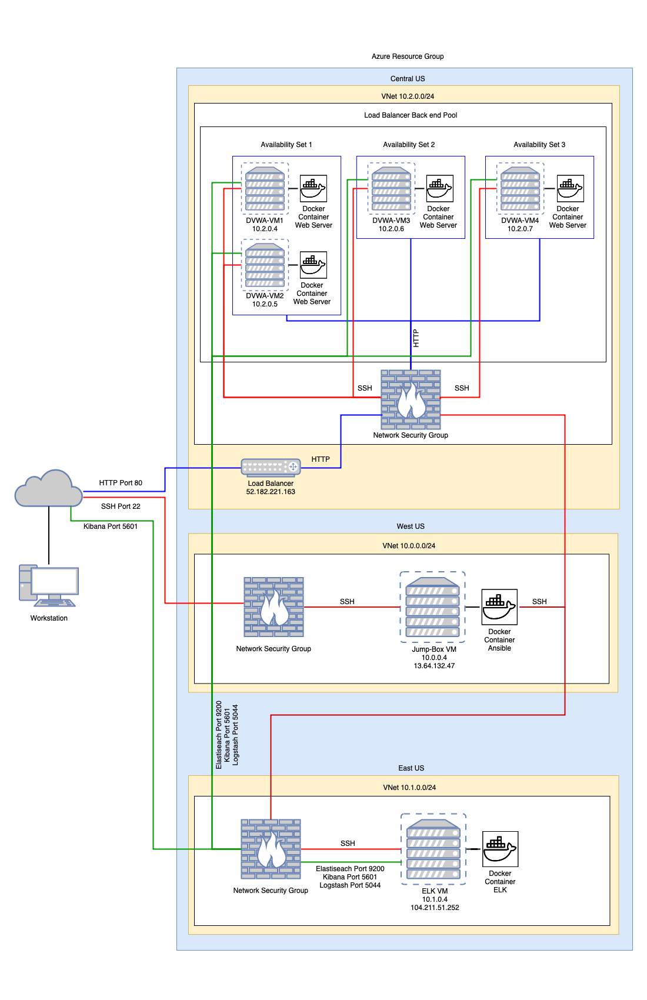
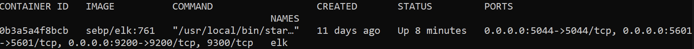
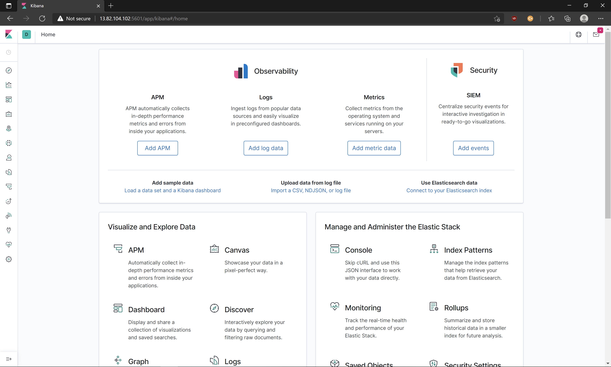
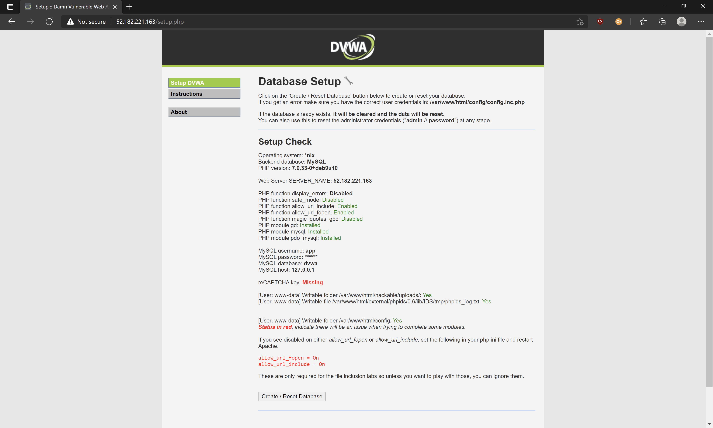

# Cybersecurity
Work related to my cybersecurity course

## Automated ELK Stack Deployment

The files in this repository were used to configure the network depicted below.



These files have been tested and used to generate a live ELK deployment on Azure. They can be used to either recreate the entire deployment pictured above. Alternatively, select portions of the [main.yml](Ansible/main.yml) file may be used to install only certain pieces of it, such as Filebeat. 

This document contains the following details:
- Description of the Topology
- Access Policies
- ELK Configuration
  - Beats in Use
  - Machines Being Monitored
- How to Use the Ansible Build


### Description of the Topology

The main purpose of this network is to expose a load-balanced and monitored instance of DVWA, the D*mn Vulnerable Web Application.

Load balancing ensures high-availability, in addition to restricting access to the network.

Integrating an ELK server allows for the monitoring of system metrics and changes to the log files on the vulnrable VMs.

The configuration details of each machine may be found below.

| Name     | Function    | IP Address | Operating System |
|:---------|:-----------:|:----------:|:----------------:|
| Jump-Box | Gateway     | 10.0.0.4   | Ubuntu 18.04     |
| Elk-VM   | Monitoring  | 10.1.0.4   | Ubuntu 18.04     |
| DVWA-VM1 | Webserver   | 10.2.0.4   | Ubuntu 18.04     |
| DVWA-VM2 | Webserver   | 10.2.0.5   | Ubuntu 18.04     |
| DVWA-VM3 | Webserver   | 10.2.0.6   | Ubuntu 18.04     |
| DVWA-VM4 | Webserver   | 10.2.0.7   | Ubuntu 18.04     |

### Access Policies

Access is restricted to the machines on the internal network. Only the Jump-Box machine can accept connections from the Internet. SSH access to this machine is only allowed from my home network. 

Machines within the network can only be accessed via SSH using the Jump-Box.
- 10.0.0.4 

A summary of the access policies in place can be found in the table below.

| Name     | Publicly Accessible | Allowed IP Addresses       |
|:---------|:-------------------:|:--------------------------:|
| Jump Box |    Yes              | 142.113.222.179            |
| Elk-VM   |    No               | 10.0.0.4                   |
| DVWA-VM1 |    No               | 10.0.0.4                   |
| DVWA-VM2 |    No               | 10.0.0.4                   |
| DVWA-VM3 |    No               | 10.0.0.4                   |
| DVWA-VM4 |    No               | 10.0.0.4                   |

### Elk Configuration

Ansible was used to automate configuration of the ELK machine. No configuration was performed manually. The [main.yml](Ansible/main.yml) ansible playbook was used to install and configure two groups of remote hosts on the network. The deployment can be setup with a single command and can be easily redeployed in an other environment. 

The playbook implements the following tasks:
- The [main.yml](Ansible/main.yml) playbook is broken down into four distinct roles referencing the playbook files contained within the [roles](Ansible/roles) folder subdirectories. First, the webservers are configured using playbooks to install DVWA, Filebeat and Metricbeat. Second, the ELK stack is installed on another host group. 
- The [install-dvwa](Ansible/roles/install-dvwa) folder contains the [main.yml](Ansible/roles/install-dvwa/tasks/main.yml) file used to setup DVWA. This playbook is configured to install Docker and python3-pip using apt-get, install the pip docker module, and to deploy a docker container running a webserver.  
- The [install-filebeat](Ansible/roles/install-filebeat) folder contains the [main.yml](Ansible/roles/install-filebeat/tasks/main.yml) file used to setup Filebeat. This playbook is configured to download and install the latest Filebeat package, copy the [filebeat.yml](Ansible/roles/install-filebeat/files/filebeat.yml) configuration file to the remote host, and issue commands to setup and start the application. 
- The [install-metricbeat](Ansible/roles/install-metricbeat) folder contains the [main.yml](Ansible/roles/install-metricbeat/tasks/main.yml) file used to setup Meticbeat. This playbook downloads and installs the latest Metricbeat package, copies the [metricbeat.yml](Ansible/roles/install-metricbeat/files/metricbeat.yml) configuration file to the remote host, and commands are issued to setup and start the application. 
- The [install-elk](Ansible/roles/install-elk) folder contains the [main.yml](Ansible/roles/install-elk/tasks/main.yml) file used to setup the ELK stack. This playbook installs Docker and python3-pip using apt-get, installs the pip docker module, and deploys a docker container running the ELK stack. 

The following screenshot displays the output of `docker ps` after successfully configuring the ELK instance.



The following screenshot displays the output of `docker ps` after successfully configuring the DVWA instance.


### Target Machines & Beats
This ELK server is configured to monitor the following machines:
- 10.2.0.4
- 10.2.0.5
- 10.2.0.6
- 10.2.0.7

The following Beats are installed on these machines:
- Filebeats
- Metricbeats

These Beats allow us to collect the following information from each machine:
- Filebeats
- Metricbeats
- _TODO: In 1-2 sentences, explain what kind of data each beat collects, and provide 1 example of what you expect to see. E.g., `Winlogbeat` collects Windows logs, which we use to track user logon events, etc._

### Using the Playbook
In order to use the playbook, you will need to have an Ansible control node already configured. Assuming you have such a control node provisioned: 

SSH into the control node and follow the steps below:
- Copy the contents of the [Ansible](Ansible) folder to:

  ```
  /etc/ansible
  ```

- Update the hosts file to include:

  ``` 
  [webservers]
  10.2.0.4 ansible_python_interpreter=/usr/bin/python3
  10.2.0.5 ansible_python_interpreter=/usr/bin/python3
  10.2.0.6 ansible_python_interpreter=/usr/bin/python3
  10.2.0.7 ansible_python_interpreter=/usr/bin/python3

  [elk]
  10.1.0.4 ansible_python_interpreter=/usr/bin/python3
  ```

- Run the playbook:
  ```
  ansible-playbook main.yml
  ```

- Navigate to the web or IP address of the ELK machine using port 5601 to confirm it is working.
  
  

- Navigate to the web or IP address of the DVWA machines to confirm it is working.
  
  