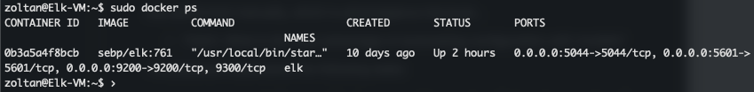

# Cybersecurity
Work related to my cybersecurity course

## Automated ELK Stack Deployment

The files in this repository were used to configure the network depicted below.


These files have been tested and used to generate a live ELK deployment on Azure. They can be used to either recreate the entire deployment pictured above. Alternatively, select portions of the [main.yml](Ansible/main.yml) file may be used to install only certain pieces of it, such as Filebeat.

This document contains the following details:
- Description of the Topology
- Access Policies
- ELK Configuration
  - Beats in Use
  - Machines Being Monitored
- How to Use the Ansible Build


### Description of the Topology

The main purpose of this network is to expose a load-balanced and monitored instance of DVWA, the D*mn Vulnerable Web Application.

Load balancing ensures high-availability, in addition to restricting access to the network.

Integrating an ELK server allows users to easily monitor the vulnerable VMs for changes to the _____ and system _____.
- _TODO: What does Filebeat watch for?_
- _TODO: What does Metricbeat record?_

The configuration details of each machine may be found below.

| Name     | Function    | IP Address | Operating System |
|:---------|:-----------:|:----------:|:----------------:|
| Jump-Box | Gateway     | 10.0.0.4   | Ubuntu 18.04     |
| Elk-VM   | Monitoring  | 10.1.0.4   | Ubuntu 18.04     |
| DVWA-VM1 | Webserver   | 10.2.0.4   | Ubuntu 18.04     |
| DVWA-VM2 | Webserver   | 10.2.0.5   | Ubuntu 18.04     |
| DVWA-VM3 | Webserver   | 10.2.0.6   | Ubuntu 18.04     |
| DVWA-VM4 | Webserver   | 10.2.0.7   | Ubuntu 18.04     |

### Access Policies

Access is restricted to the machines on the internal network. Only the Jump-Box machine can accept connections from the Internet. SSH access to this machine is only allowed from my home network. 

Machines within the network can only be accessed via SSH using the Jump-Box.
- 10.0.0.4 

A summary of the access policies in place can be found in the table below.

| Name     | Publicly Accessible | Allowed IP Addresses       |
|:---------|:-------------------:|:--------------------------:|
| Jump Box |    Yes              | 142.113.222.179            |
| Elk-VM   |    No               | 10.0.0.4                   |
| DVWA-VM1 |    No               | 10.0.0.4                   |
| DVWA-VM2 |    No               | 10.0.0.4                   |
| DVWA-VM3 |    No               | 10.0.0.4                   |
| DVWA-VM4 |    No               | 10.0.0.4                   |

### Elk Configuration

Ansible was used to automate configuration of the ELK machine. No configuration was performed manually, which is advantageous because...
- _TODO: What is the main advantage of automating configuration with Ansible?_

The playbook implements the following tasks:
- _TODO: In 3-5 bullets, explain the steps of the ELK installation play. E.g., install Docker; download image; etc._
- ...
- ...

The following screenshot displays the result of running `docker ps` after successfully configuring the ELK instance.



### Target Machines & Beats
This ELK server is configured to monitor the following machines:
- 10.2.0.4
- 10.2.0.5
- 10.2.0.6
- 10.2.0.7

We have installed the following Beats on these machines:
- Filebeats
- Metricbeats

These Beats allow us to collect the following information from each machine:
- _TODO: In 1-2 sentences, explain what kind of data each beat collects, and provide 1 example of what you expect to see. E.g., `Winlogbeat` collects Windows logs, which we use to track user logon events, etc._

### Using the Playbook
In order to use the playbook, you will need to have an Ansible control node already configured. Assuming you have such a control node provisioned: 

SSH into the control node and follow the steps below:
- Copy the contents of the [Ansible](Ansible) folder to:

  ```
  /etc/ansible
  ```

- Update the hosts file to include:

  ``` 
  [webservers]
  10.2.0.4 ansible_python_interpreter=/usr/bin/python3
  10.2.0.5 ansible_python_interpreter=/usr/bin/python3
  10.2.0.6 ansible_python_interpreter=/usr/bin/python3
  10.2.0.7 ansible_python_interpreter=/usr/bin/python3

  [elk]
  10.1.0.4 ansible_python_interpreter=/usr/bin/python3
  ```

- Run the playbook, and navigate to ____ to check that the installation worked as expected.

_TODO: Answer the following questions to fill in the blanks:_
- _Which file is the playbook? Where do you copy it?_
- _Which file do you update to make Ansible run the playbook on a specific machine? How do I specify which machine to install the ELK server on versus which to install Filebeat on?_
- _Which URL do you navigate to in order to check that the ELK server is running?

_As a **Bonus**, provide the specific commands the user will need to run to download the playbook, update the files, etc._